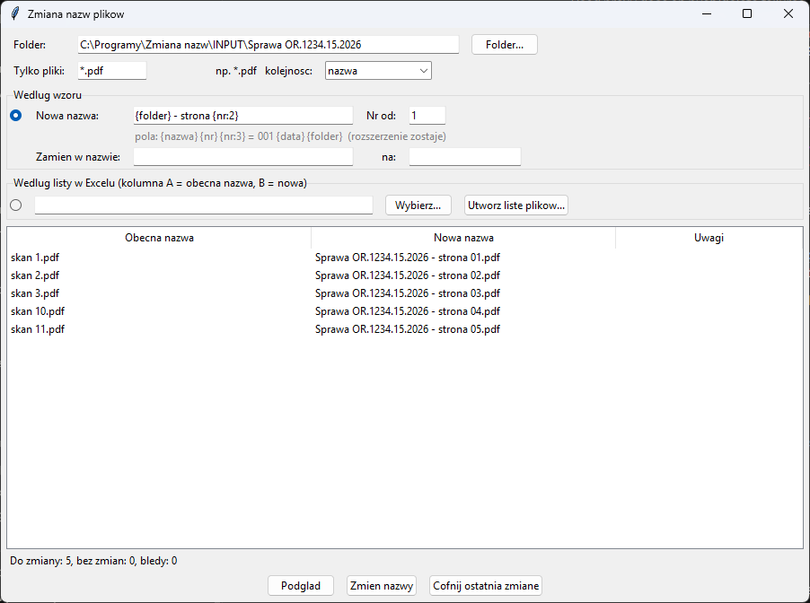

# Zmiana nazw plików

Masowa zmiana nazw plików w folderze — według wzoru (numeracja, data,
nazwa folderu, zamiana tekstu) albo według listy w Excelu. Przed zmianą
widać **podgląd** wszystkich nowych nazw, konflikty są blokowane, a ostatnią
zmianę można **cofnąć**. Przydaje się przy skanach (`skan 1.pdf` →
`Sprawa OR.1234.15.2026 - strona 01.pdf`), zdjęciach, załącznikach do
spraw i plikach do publikacji w BIP.

Program **lokalny**: działa tylko na plikach w Twoim komputerze. Z internetem
łączy się tylko po to, żeby sprawdzić [aktualizacje](#aktualizacje).



## Według wzoru

W polu **Nowa nazwa** wpisz wzór. Rozszerzenie pliku (`.pdf`, `.jpg`…)
zostaje bez zmian.

| Pole | Co wstawia | Przykład |
|------|------------|----------|
| `{nazwa}` | obecna nazwa (bez rozszerzenia) | `skan 1` |
| `{nr}` | kolejny numer, od **Nr od** | `1`, `2`, … `10` |
| `{nr:3}` | numer z zerami do 3 cyfr | `001`, `002`, … `010` |
| `{data}` | data modyfikacji pliku | `2026-10-04` |
| `{folder}` | nazwa folderu z plikami | `Sprawa OR.1234.15.2026` |

Przykłady:
- `{folder} - strona {nr:2}` → `Sprawa OR.1234.15.2026 - strona 01.pdf`
- `{data} {nazwa}` → `2026-10-04 skan 1.pdf`
- `Załącznik {nr} - {nazwa}` → `Załącznik 1 - umowa.pdf`

**Zamień w nazwie … na …** zamienia fragment tekstu w obecnej nazwie
(przed zastosowaniem wzoru), np. `skan` na `strona`. Pozostaw wzór
`{nazwa}`, żeby tylko zamienić tekst.

**Tylko pliki** ogranicza zmianę do wybranych plików, np. `*.pdf`,
`skan*`. **Kolejność** decyduje o numeracji: według nazwy (naturalnie:
`skan 2` przed `skan 10`) albo według daty modyfikacji (od najstarszego).

## Według listy w Excelu

1. Kliknij **Utwórz listę plików…** i zapisz plik. Otworzy się Excel
   z obecnymi nazwami w kolumnie **A**.
2. W kolumnie **B** wpisz nowe nazwy. Puste komórki = plik zostaje bez
   zmian. Rozszerzenie można pominąć — zostanie dopisane.
3. Zapisz plik w Excelu i kliknij **Podgląd**.

Listę można też przygotować samemu: pierwszy wiersz to nagłówek,
kolumna A = obecna nazwa, kolumna B = nowa nazwa.

## Podgląd, konflikty, cofanie

- **Podgląd** pokazuje każdą starą i nową nazwę. Wiersze z błędem są
  czerwone, a **Zmień nazwy** jest wtedy zablokowane. Błędy to: dwa pliki
  o tej samej nowej nazwie, nazwa zajęta przez inny plik, znak niedozwolony
  w Windows (`\ / : * ? " < > |`), brak pliku z listy.
- Zamiana nazw miejscami (`a` ↔ `b`) i zmiana samej wielkości liter
  (`notatka.pdf` → `Notatka.pdf`) działają.
- Jeśli zmiana nie uda się w połowie (np. plik otwarty w innym programie),
  już zmienione nazwy wracają do poprzednich — nie zostaje pół na pół.
- **Cofnij ostatnią zmianę** przywraca poprzednie nazwy. Można cofać
  kolejne zmiany, od najnowszej. Historia zmian jest zapisywana w folderze
  `OUTPUT` (`historia_*.csv`, do otwarcia w Excelu).

## Instalacja (jednorazowo)

1. **Python** — pobierz z [python.org](https://www.python.org/downloads/windows/)
   (wersja 3.9 lub nowsza). W instalatorze zaznacz **„Add python.exe to PATH”**.
   Opcja „tcl/tk and IDLE” jest zaznaczona domyślnie i musi taka zostać.
   Uprawnienia administratora nie są potrzebne.
2. **Program** — na stronie [github.com/DawidBochno/Zmiana-nazw](https://github.com/DawidBochno/Zmiana-nazw)
   kliknij zielony przycisk **Code → Download ZIP**. Rozpakuj archiwum,
   np. do `C:\Programy\Zmiana nazw`. Nie uruchamiaj programu z wnętrza ZIP-a.
3. Kliknij dwukrotnie **`install.bat`**. Instaluje bibliotekę `openpyxl`
   (potrzebny internet) i uruchamia test. Na końcu pojawia się
   **„selftest OK”**, co znaczy, że wszystko działa.
   Jeśli Windows pokaże „System Windows ochronił ten komputer”, kliknij
   **Więcej informacji → Uruchom mimo to**.
4. Program uruchamia się plikiem **`uruchom.bat`**. Wygodnie jest zrobić
   skrót na pulpicie: prawy przycisk na `uruchom.bat` → **Wyślij do →
   Pulpit (utwórz skrót)**.

## Aktualizacje

Po uruchomieniu program sprawdza w tle na GitHubie, czy jest nowa wersja.
Jeśli jest, pyta **„Pobrać i zainstalować teraz?”**. Pobierane są tylko
zmienione pliki programu. Foldery `INPUT`, `OUTPUT` (z historią zmian)
i ustawienia nie są nadpisywane. Po aktualizacji zamknij i uruchom program ponownie. Jeśli program
o to poprosi, uruchom też raz `install.bat` (zmieniły się biblioteki).

- Do GitHuba trafia tylko zapytanie o listę plików programu, **nigdy
  nazwy Twoich plików**.
- Bez internetu albo przy blokadzie (np. UTM) program działa normalnie,
  bez żadnego komunikatu.
- **Wyłączenie** (np. gdy programy aktualizuje dział IT): utwórz w folderze
  programu pusty plik o nazwie `NIE_AKTUALIZUJ`.
- Kopię pobraną przez `git clone` aktualizuje się poleceniem `git pull`.

## Ograniczenia

- Zmieniane są tylko pliki w wybranym folderze, **bez podfolderów**;
  nazwy folderów się nie zmieniają.
- Lista w Excelu dotyczy jednego folderu (tego wybranego w polu **Folder**).
- Cofnąć można tylko zmiany zrobione tym programem.

## Testy

```bash
python zmiana_nazw.py --selftest
```

Test sprawdza sortowanie naturalne, wszystkie pola wzoru, wykrywanie
konfliktów i niedozwolonych nazw, zamianę nazw miejscami, zmianę wielkości
liter, kolejność według daty, cofanie (także odmowę cofnięcia, gdy pliki
zmieniły się w międzyczasie), wycofanie zmian po błędzie w połowie, plik
powtórzony na liście oraz listę w Excelu.
